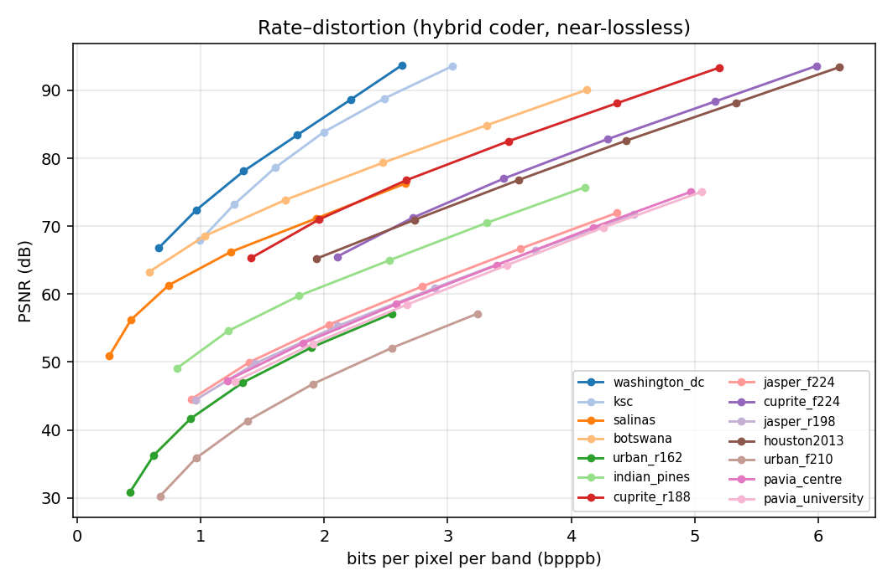
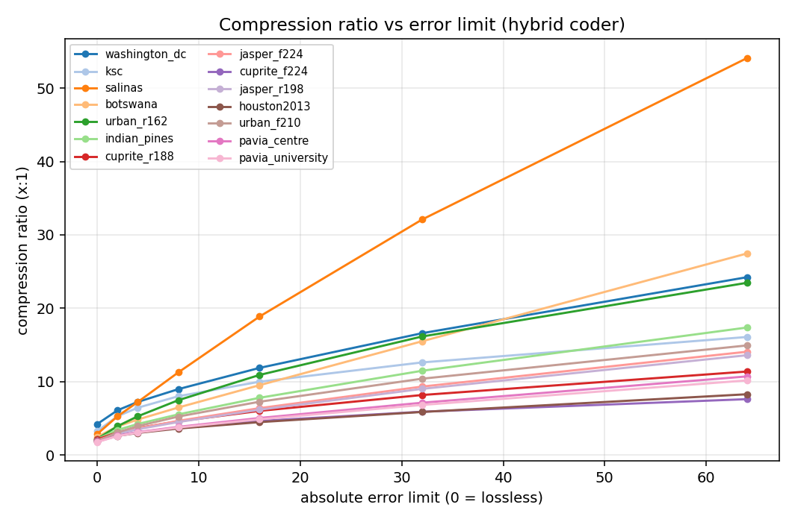
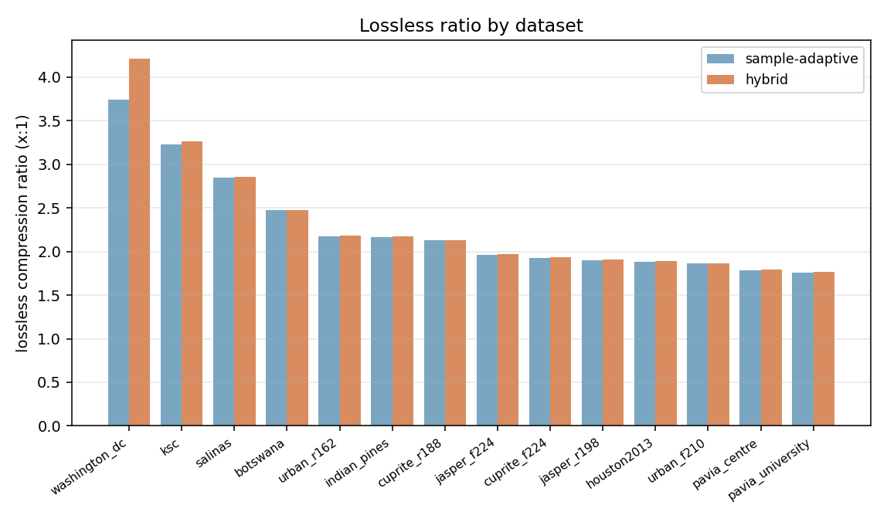

# CCSDS-123.0-B-2 image codec

A pure-integer implementation of the CCSDS-123.0-B-2 standard for lossless and
near-lossless multispectral / hyperspectral image compression.

The encoder and decoder share a single prediction loop, so `compress -> decompress`
is bit-exact by construction. The core is numpy; with [numba](https://numba.pydata.org/) installed a JIT fast path runs automatically (byte-identical to the reference, ~100-200x faster).

## Quick start

```python
import numpy as np
from src.ccsds import CCSDS123

img = np.random.randint(0, 1 << 16, size=(100, 64, 64)).astype(np.int64)  # [Z, Y, X]

codec = CCSDS123.from_image(img, num_prediction_bands=3)  # lossless by default
blob  = codec.compress(img)        # -> bytes (CCSDS 5.3 header + body)
recon = codec.decompress(blob)     # -> np.ndarray

assert np.array_equal(img, recon)
```

Near-lossless, with an absolute (and/or relative, per-band) error limit:

```python
codec = CCSDS123.from_image(img, lossless=False, absolute_error_limit=4)
recon = codec.decompress(codec.compress(img))
assert np.abs(img - recon).max() <= 4
```

Quality metrics for near-lossless reconstructions (numpy-only: PSNR, MSSIM, SAM):

```python
from src.ccsds import quality_report
print(quality_report(img, recon, dynamic_range=16))
# {'psnr_db': ..., 'mssim': ..., 'sam_rad': ..., 'max_abs_error': ...}
```

Decode a blob without holding a configured codec; the parameters come from the
header:

```python
recon = CCSDS123.decompress_bytes(blob)
```

## What it implements

- **Adaptive predictor** (4.x): local sums (eq 20-23, wide/narrow × neighbor/column),
  directional and central local differences, the full weight-update rule with the
  time-varying scaling exponent ρ(t), high-resolution prediction, the quantizer, and
  the fold-over mapped quantizer index.
- **Fidelity control** (4.8.2): lossless, absolute, relative, and combined error
  limits, each band-independent or band-dependent.
- **Encoding order** (5.4.2): BSQ (default) or band-interleaved (BI: BIP, BIL, or an
  intermediate sub-frame depth M), with optional **periodic error-limit updating**
  (4.8.2.4) that carries per-period limits in the body.
- **Two entropy coders**: sample-adaptive (5.4.3.2, default) and hybrid (5.4.3.3,
  `entropy_coder="hybrid"`) using the real annex-B low-entropy tables with
  reverse-order suffix-free decoding.
- **Bit-exact CCSDS 5.3 header** (`io/ccsds_header.py`): packs/parses every supported
  parameter; the lossless header is 19 bytes.

Not implemented: the block-adaptive coder (5.4.3.4 / CCSDS-121) and the optional
supplementary / weight tables.

## Layout

```
src/ccsds/
  codec.py                 CCSDS123 high-level wrapper (numpy or torch)
  metrics.py               PSNR / MSSIM / SAM (numpy-only)
  core/reference_codec.py  Ccsds123 / CodecParams (the codec)
  core/_codec_numba.py     numba kernel (byte-identical fast path)
  entropy/hybrid.py        hybrid entropy coder (5.4.3.3)
  entropy/_hybrid_numba.py numba hybrid kernels
  entropy/annexb_tables.json   annex-B low-entropy code tables
  io/ccsds_header.py       CCSDS 5.3 header pack/parse
tests/
  test_reference_codec.py  end-to-end suite (synthetic cube; numba checked if present)
  synthetic_hsi.py         deterministic test cube (pure numpy)
  run_full_cube.py         full-size headline run
tools/extract_annexb_tables.py   regenerate annexb_tables.json from the standard text
examples/evaluate.py             compress a cube + report ratio / PSNR / MSSIM / SAM
```

## Testing

```bash
python3 tests/test_reference_codec.py     # self-contained; no data files needed
python3 tests/run_full_cube.py            # full 145×145×220-size cube
```

The suite runs on a deterministic synthetic cube, so it works from a fresh clone with
only numpy. If a local Indian Pines `.mat` is found it is exercised too (lossless,
~2.49:1). With numba installed, the JIT kernels are checked byte-for-byte against the
pure-Python reference.

## Evaluating quality

`examples/evaluate.py` compresses a cube at lossless and a sweep of near-lossless error
limits and prints compression ratio with PSNR / MSSIM / SAM:

```bash
python3 examples/evaluate.py                                  # Indian Pines if present, else synthetic
python3 examples/evaluate.py --entropy hybrid --limits 0 8 16 32 64
python3 examples/evaluate.py --input cube.npy --peak data     # PSNR vs the data's actual peak
```

On Indian Pines, lossless is ~2.47:1; the hybrid coder reaches ~16:1 at an absolute
error limit of ~44 (every sample then within ±44 of the original).

## Benchmark

Whole-cube results across 14 standard HSI scenes (`examples/benchmark.py`, hybrid coder).
Each scene is the raw integer DN cube; near-lossless bounds the per-sample error exactly by
the limit, and PSNR is reported against each scene's data peak.







Lossless is **1.77–4.21:1** (median ~2:1). Near-lossless scales much further — Salinas reaches
**54:1** at an error limit of 64. The hybrid coder ties sample-adaptive when lossless but pulls
well ahead as the limit grows (it packs the mostly-zero residuals into sub-1-bit codes).

| dataset | bands | D | lossless | a=4 | a=16 | a=64 |
|---|--:|--:|--:|--:|--:|--:|
| washington_dc | 191 | 16 | 4.21:1 | 7.2:1 | 11.9:1 | 24.2:1 |
| ksc | 176 | 16 | 3.26:1 | 6.4:1 | 10.0:1 | 16.1:1 |
| salinas | 204 | 14 | 2.86:1 | 7.2:1 | 18.9:1 | 54.1:1 |
| botswana | 145 | 16 | 2.48:1 | 4.8:1 | 9.5:1 | 27.5:1 |
| urban_r162 | 162 | 10 | 2.18:1 | 5.3:1 | 10.9:1 | 23.5:1 |
| indian_pines | 220 | 14 | 2.17:1 | 4.2:1 | 7.8:1 | 17.4:1 |
| cuprite_r188 | 188 | 16 | 2.13:1 | 3.7:1 | 6.0:1 | 11.4:1 |
| jasper_f224 | 224 | 13 | 1.97:1 | 3.6:1 | 6.4:1 | 14.1:1 |
| cuprite_f224 | 224 | 16 | 1.93:1 | 3.1:1 | 4.6:1 | 7.6:1 |
| jasper_r198 | 198 | 13 | 1.91:1 | 3.5:1 | 6.2:1 | 13.6:1 |
| houston2013 | 144 | 16 | 1.89:1 | 3.0:1 | 4.5:1 | 8.3:1 |
| urban_f210 | 210 | 10 | 1.87:1 | 3.9:1 | 7.3:1 | 14.9:1 |
| pavia_centre | 102 | 13 | 1.79:1 | 3.1:1 | 5.0:1 | 10.7:1 |
| pavia_university | 103 | 13 | 1.77:1 | 3.1:1 | 4.9:1 | 10.2:1 |

Reproduce (reads `<dataset>/zarr/cube.zarr`, needs `zarr`; non-integer/normalised cubes are
auto-skipped — here `samson` was skipped as normalised and the 752M-sample `chikusei` by size):

```bash
python3 examples/benchmark.py --root <data-dir> --out assets/benchmark_local.csv
python3 examples/plot_benchmark.py --csv assets/benchmark_local.csv --out assets
```

## References

1. *Low-Complexity Lossless and Near-Lossless Multispectral and Hyperspectral Image
   Compression*, CCSDS 123.0-B-2, February 2019.
2. Kiely et al., *The New CCSDS Standard for Low-Complexity Lossless and Near-Lossless
   Multispectral and Hyperspectral Image Compression*.
3. Klimesh, *Fast Lossless Compression of Multispectral Images*, 2005.

For research and educational use. The CCSDS specifications are publicly available from
the Consultative Committee for Space Data Systems.
